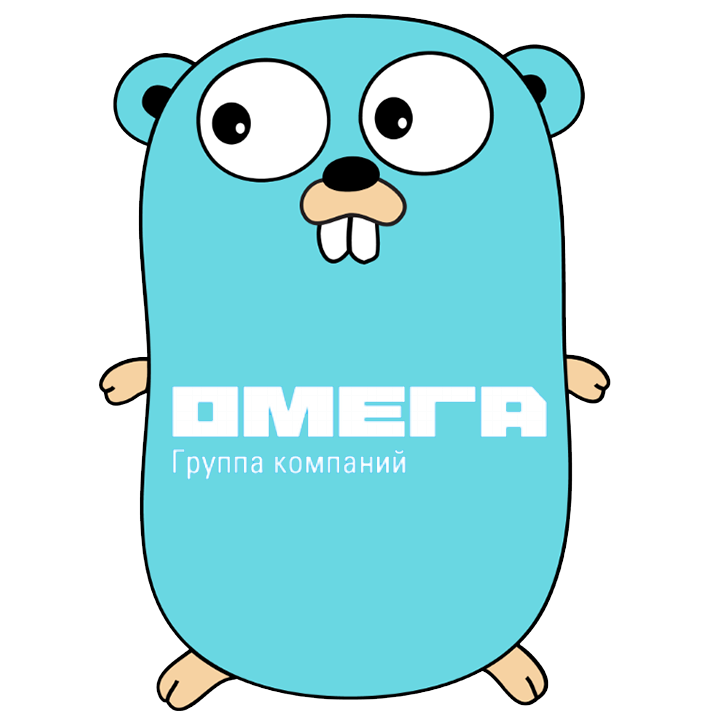

# etsp

 

Парсер сайта etsp.ru с интерфейсом в виде телеграм бота [ws_etsp_bot](https://t.me/ws_etsp_bothttps://t.me/ws_etsp_bot).

## Структура проекта

Проект имеет [трёхуровневую архитектуру](https://ru.wikipedia.org/wiki/Трёхуровневая_архитектураhttps://ru.wikipedia.org/wiki/Трёхуровневая_архитектура) в соответствии с распределением директорий проекта: *cmd*, *internal*, *pkg*. Пожалуйста посмотрите [стандартный проект на Golang](https://github.com/golang-standards/project-layouthttps://github.com/golang-standards/project-layout).

### *cmd*

Запуск программы начинается именно отсюда. Данная директория вызывает рабочие функции из *internal*, где и происходит "бизнес-логика".

### *internal*

Данная директория отвечает за сам [поиск товаров](https://github.com/github/RB-PRO/etsp/internal/Search.go) и [телеграм бота](https://github.com/github/RB-PRO/etsp/internal/telegram.go), который использует библиотеку [tgbotapi](https://github.com/go-telegram-bot-api/telegram-bot-api/).

### *pkg*

Структурированная часть проекта, которая содержит функционал по взаимодействию с [API etsp v2](https://ws.etsp.ru/Help/v2/Default.aspxhttps://ws.etsp.ru/Help/v2/Default.aspx). Данная часть можнт быть использована в иных проектах путём копирования с помощью команды `git clone`
